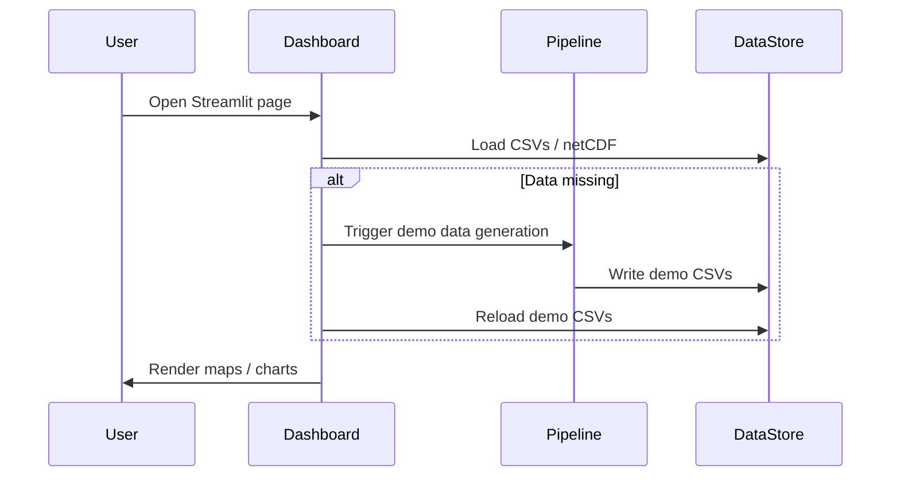

# System Architecture — ISRO AQI & HCHO Platform

This document contains architecture diagrams and notes for the data pipeline, model training, and dashboard components.

## Overview

- Data ingestion: Sentinel-5P (TROPOMI), INSAT-3D AOD, ERA5 reanalysis, FIRMS fire detections, CPCB ground stations.
- Preprocessing: `scripts/run_pipeline.py` orchestrates downloads and builders in `src/data/`.
- Feature engineering: `src/data/build_dataset_aqi.py`, `src/data/build_dataset_hcho.py` generate gridded daily features.
- Models: baseline ML (`src/models/baseline_ml.py`) and deep learning (`src/models/train_aqi.py`).
- Dashboard: Streamlit app at `src/webapp/app.py` provides maps and analysis.

## Mermaid Diagrams

### High-level dataflow

```mermaid
flowchart TD
  subgraph Sources
    TROPOMI[TROPOMI \n (NO2, HCHO, O3, CO, SO2)]
    INSAT[INSAT-3D AOD]
    ERA5[ERA5 Reanalysis]
    FIRMS[FIRMS Fires]
    CPCB[CPCB Stations]
  end

  TROPOMI -->|extract| feature_builder[build_dataset_hcho / build_dataset_aqi]
  INSAT -->|AOD| feature_builder
  ERA5 -->|met vars| feature_builder
  FIRMS -->|fire counts| feature_builder
  CPCB -->|ground PM2.5| feature_builder

  feature_builder --> gridded_storage[data/processed/*.csv / netCDF]
  gridded_storage --> models[baseline_ml / cnn_lstm]
  models --> predictions[models/baseline/*.csv / models/cnn_lstm/*.pt]
  predictions --> dashboard[src/webapp/app.py]

  gridded_storage --> dashboard
```
```

### Component interaction (deployment)




## Files to check
- `src/utils/config_utils.py` — central date resolution
- `scripts/validate_credentials.py` — credential checks
- `scripts/run_pipeline.py` — orchestrator
- `src/webapp/app.py` — dashboard front-end

Save other diagrams in `docs/diagrams/` as needed.

## ML Diagrams

Detailed ML model and workflow diagrams are stored in the `docs/diagrams/` folder:

- ML model architecture (CNN-LSTM): [docs/diagrams/ml_model_architecture.md](docs/diagrams/ml_model_architecture.md)
- Training & deployment workflow: [docs/diagrams/ml_training_workflow.md](docs/diagrams/ml_training_workflow.md)

You can view the Mermaid source in those files or preview them with a Markdown renderer that supports Mermaid.
